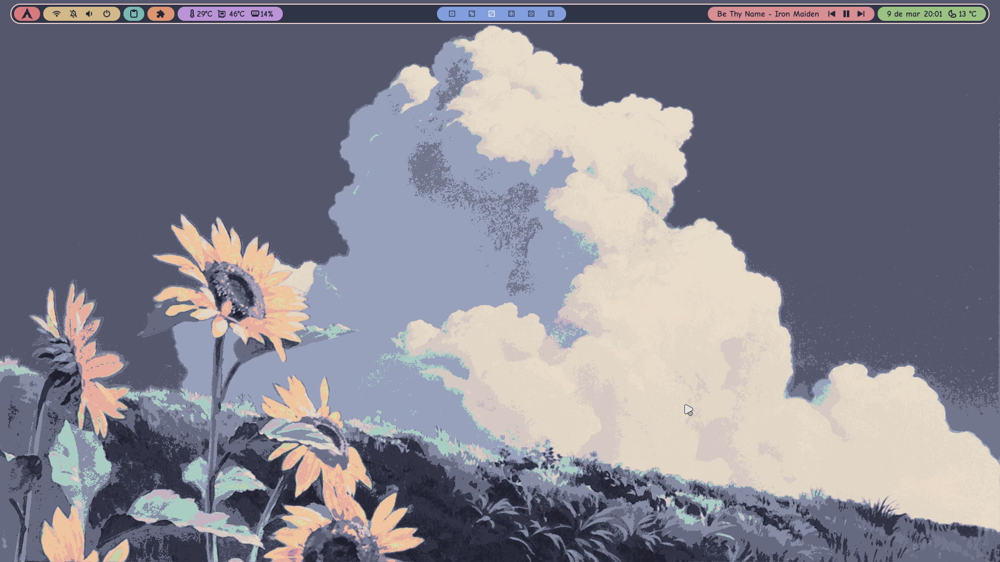
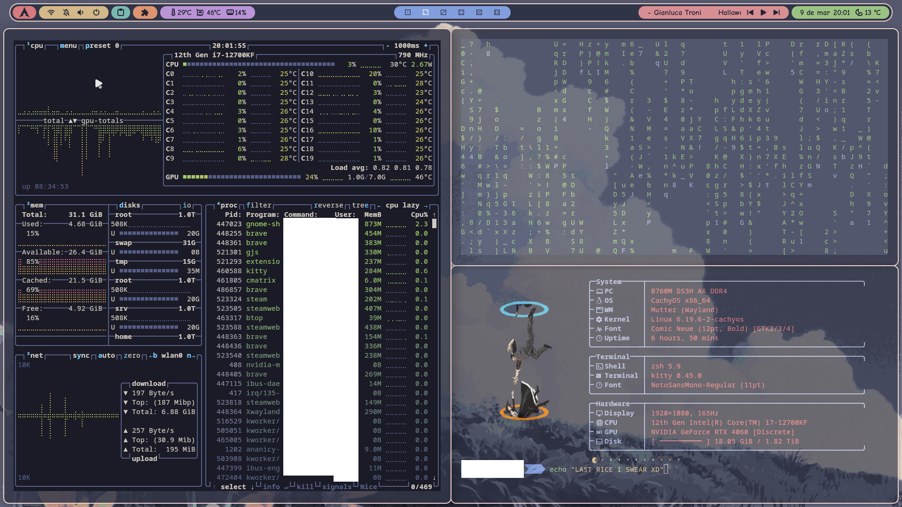
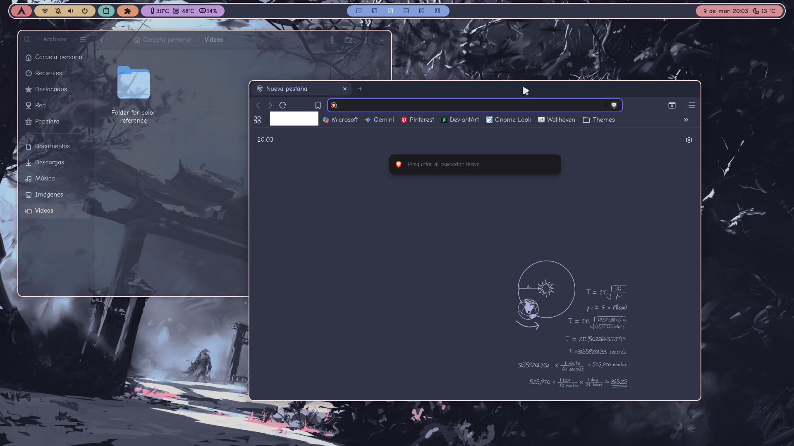
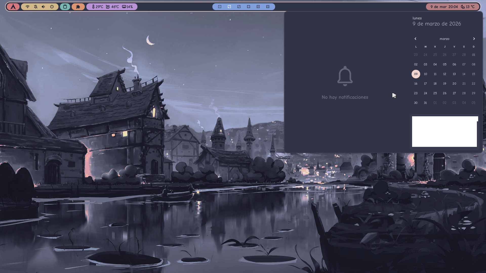

# Catppuccin Gnome Guide

A comprehensive guide for ricing with catppuccin theme as a base

## Features

- Easy installation instructions
- Extensions that are useful
- Full customization guide
- GNOME customization tips


## Visual Examples

**Desktop:**


**Terminal:**


**Files and Brave:**


**Menus:**



## Before installing the theme

Install all necessary components so the theme works:

### Installation Commands by Distribution

| Package | Ubuntu/Debian | Arch/Manjaro | Fedora |
|---------|---------------|--------------|--------|
| **GNOME Tweaks** | `sudo apt install gnome-tweaks` | `sudo pacman -S gnome-tweaks` | `sudo dnf install gnome-tweaks` |
| **Extensions Manager** | `sudo apt install gnome-extensions-app` | `sudo pacman -S gnome-extensions-app` | `sudo dnf install gnome-extensions-app` |

### User Themes Extension

1. Open GNOME Extensions Manager
2. Search for "User Themes"
3. Install from: https://extensions.gnome.org/extension/19/user-themes/

### Create Required Folders

Create these folders in your home directory (if not created previously):

```bash
mkdir -p ~/.themes
mkdir -p ~/.icons
```

## Installation

Install all necessary components for the Catppuccin theme:

- Installing the theme: https://github.com/Fausto-Korpsvart/Catppuccin-GTK-Theme

### Steps:

1. Follow the official Catppuccin theme GitHub instructions
2. Choose your preferred:
   - Color flavor (Mocha, Macchiato, Frappe, Latte)
   - Tone (Dark or Light)
   - Variant and accent color
3. Apply the theme in GNOME TWEAKS


- Installing the Cursor: https://www.gnome-look.org/p/1346778

### Steps:

1. Download the preferred cursor (Light, dark or material)
2. Extract files at .icons folder created previously

- Installing the icons: I use the default adwaita icons, you can choose the one you like most (Also with cursor)
### Steps:

1. Download the preferred icon pack
2. Extract files at .icons folder created previously
