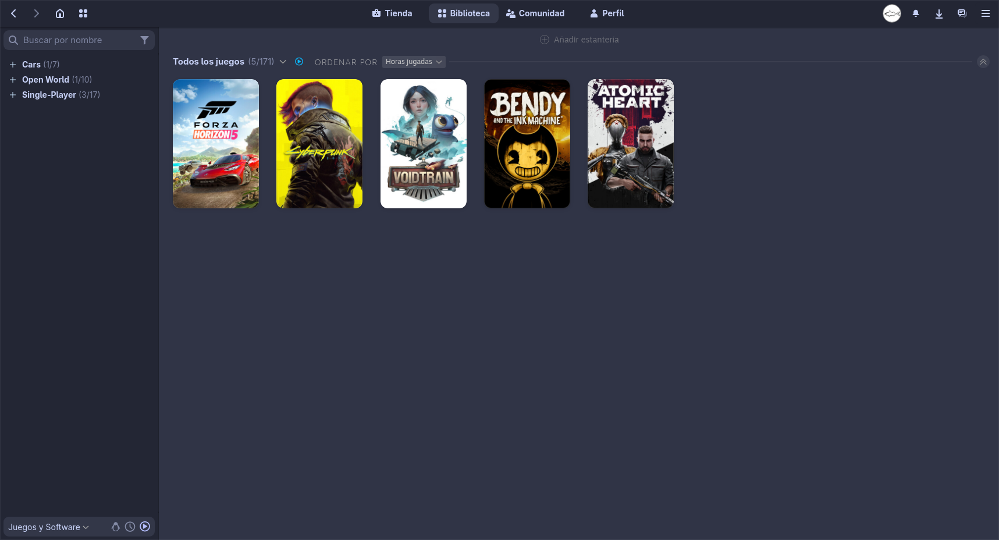

# 🎮 Steam Temes guide

To make Steam match your GNOME desktop perfectly, we’ll use the **Adwaita-for-Steam** skin. This allows you to apply themes like Catppuccin or Gruvbox to the Steam client.

All resources and detailed documentation can be found at the official site: https://github.com/tkashkin/Adwaita-for-Steam
## Installation

1. Clone or download the repository:
```bash
git clone https://github.com/tkashkin/Adwaita-for-Steam
cd Adwaita-for-Steam
./install.py
```

2. List Options
```bash
./install.py -l
```

3. Install Customizations (Example)
```bash
./install.py -c catppuccin-frappe -e library/hide_whats_new
```

---
## Preview


